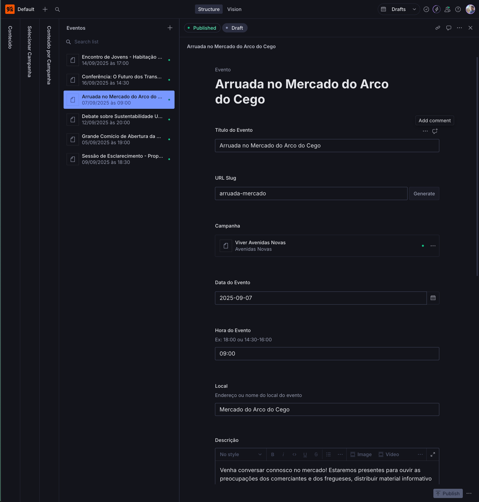
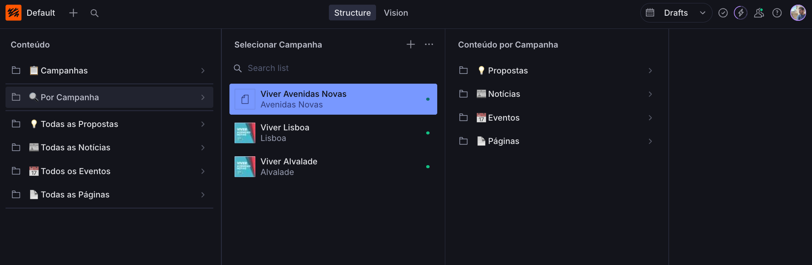
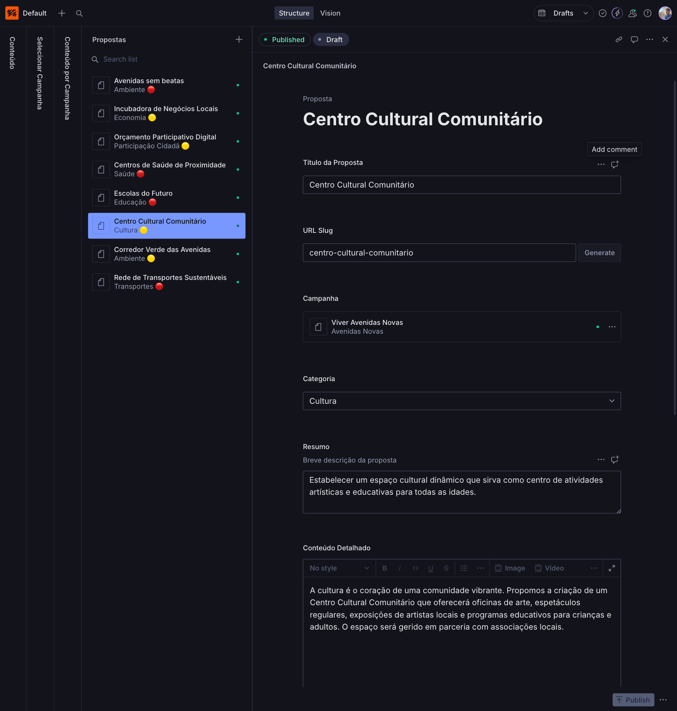
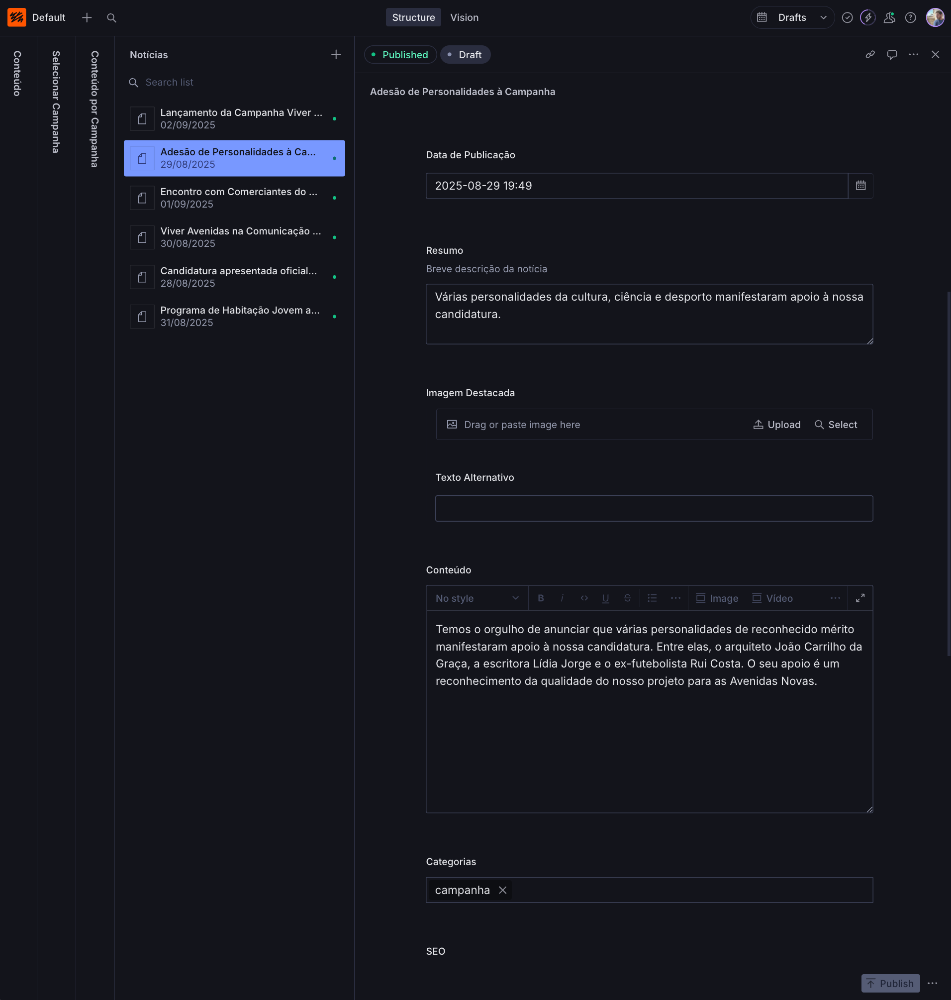

# 🌐 **Sistema de Websites para Candidaturas Autárquicas 2025**

## 📖 **O que é este Sistema?**

O **Sistema Viver** é uma plataforma web completa, desenvolvida especialmente para apoiar as candidaturas da coligação de esquerda nas **Eleições Autárquicas de Lisboa 2025**. 

Trata-se de uma solução técnica moderna que permite a **cada candidatura** ter o seu próprio website profissional, mantendo uma **identidade visual coerente** da coligação, mas com **conteúdo totalmente personalizado** para as especificidades locais.

---

## 🎯 **Para que Serve?**

### **Para as Candidaturas:**
- ✅ **Website profissional** sem custos de desenvolvimento
- ✅ **Gestão de conteúdo fácil** através do Sanity CMS
- ✅ **Identidade visual consistente** da coligação
- ✅ **Flexibilidade total** para conteúdo local
- ✅ **Funcionalidades completas**: propostas, eventos, notícias, páginas personalizadas
- ✅ **Design responsivo** para todos os dispositivos
- ✅ **SEO otimizado** para melhor visibilidade online

### **Para a Coligação:**
- 🎨 **Coerência visual** em todas as candidaturas
- 📊 **Gestão centralizada** da infraestrutura técnica
- 🚀 **Rápido lançamento** de novos websites
- 💰 **Economia de recursos** (desenvolvimento partilhado)
- 🛠️ **Manutenção eficiente** e atualizações centralizadas

---

## 🏛️ **Estrutura do Sistema**

### **Multi-Domínio e Isolamento**
Cada freguesia terá:
- **Domínio próprio**: `viverfreguesianome.pt`
- **Conteúdo isolado**: Totalmente independente entre freguesias
- **Gestão individual**: Cada candidatura gere o seu conteúdo
- **Base comum**: Design e funcionalidades partilhadas

### **Funcionalidades Incluídas**
- 📋 **Propostas/Programa**: Apresentação detalhada das propostas eleitorais
- 📰 **Notícias**: Comunicação regular com os munícipes
- 📅 **Eventos**: Agenda de atividades e iniciativas
- 📄 **Páginas Personalizadas**: Conteúdo específico (Sobre Nós, Como Apoiar, etc.)
- 📞 **Contactos**: Informações de contacto dinâmicas
- 🔗 **Redes Sociais**: Integração com plataformas sociais
- 📱 **Mobile First**: Otimizado para telemóveis e tablets

---

## 🤝 **Como Aderir**

1. **Manifestar interesse** junto da coordenação
2. **Definir domínio** e detalhes da candidatura
3. **Comprar domínio** (normalmente o primeiro ano de domínios .pt é gratuíto)
4. **Receber credenciais** de acesso
5. **Formação básica** para utilização do sistema
6. **Lançamento** do website

---

## 👥 **Como Funciona?**

### **1. Setup Inicial**
- A **infraestrutura técnica** é configurada centralmente
- Cada freguesia recebe **acesso ao seu painel de gestão**
- O **domínio específico** é configurado e ativado

### **2. Gestão de Conteúdo**
- **Interface intuitiva**: O Sanity CMS permite gestão visual do conteúdo
- **Sem conhecimentos técnicos**: Qualquer pessoa pode adicionar/editar conteúdo
- **Preview em tempo real**: Vê as alterações antes de publicar
- **Colaboração**: Vários utilizadores podem gerir o mesmo website

### **3. Personalização**
- **Cores da campanha**: Adaptar às cores específicas da freguesia
- **Logo local**: Upload do logotipo da candidatura
- **Conteúdo único**: Propostas, biografia de candidatos, agenda local
- **Informações de contacto**: Dados específicos da candidatura local

---

## 🚀 **Como Utilizar o Sistema**

### **Passo 1: Acesso ao Painel**
1. Recebe credenciais de acesso ao **Sanity Studio**
2. Acede através do link: `https://viverlisboa.sanity.studio/`
3. Faz login com as credenciais fornecidas

### **Passo 2: Estrutura do Sanity Studio**

O **Sanity Studio** está organizado de forma intuitiva para facilitar a gestão de conteúdo:

*Interface do Sanity Studio com sistema multi-campanha*

#### **🗂️ Navegação Principal** (Painel Esquerdo)
- **📁 Campanhas**: Configurações gerais de cada campanha
- **🎯 Por Campanha**: Acesso direto ao conteúdo específico
- **📋 Todas as Propostas**: Vista global de todas as propostas
- **📰 Todas as Notícias**: Vista global de todas as notícias
- **🗓️ Todos os Eventos**: Vista global de todos os eventos
- **📄 Todas as Páginas**: Vista global de páginas personalizadas

*Esta navegação permite tanto gestão específica por campanha como vista geral de todo o conteúdo.*

#### **🎯 Seleção de Campanha** (Painel Central)
**Sistema Multi-Campanha:** O Sanity permite gerir várias candidaturas simultaneamente:
- **🟦 Viver Avenidas Novas** (Avenidas Novas) - *ativa*
- **🟦 Viver Lisboa** (Lisboa) - *ativa*  
- **🟦 Viver Alvalde** (Alvalde) - *ativa*
- **➕ Adicionar Nova Campanha**: Expandir para novas freguesias

*Cada campanha mantém o seu conteúdo totalmente isolado das outras.*

#### **📝 Gestão de Conteúdo** (Painel Direito)
**Após selecionar uma campanha específica:**
- **💡 Propostas**: Programa eleitoral da freguesia
- **📰 Notícias**: Comunicados locais e atualizações
- **🗓️ Eventos**: Agenda específica da candidatura
- **📄 Páginas**: Conteúdo personalizado (Sobre Nós, etc.)

*Todo o conteúdo criado aqui aparece exclusivamente no website dessa campanha.*

#### **🔐 Isolamento de Conteúdo**
**Princípio Fundamental:** Cada candidatura vê e gere apenas o seu próprio conteúdo.

**✅ O que cada campanha pode fazer:**
- Criar e editar as suas próprias propostas
- Gerir a sua agenda de eventos
- Publicar notícias locais
- Personalizar páginas específicas

**🚫 O que NÃO podem ver/fazer:**
- Aceder ao conteúdo de outras campanhas
- Modificar configurações globais
- Ver dados de outras freguesias
- Interferir com outros websites

### **Passo 3: Gestão de Cada Tipo de Conteúdo**

#### **📰 Gestão de Notícias**
**Exemplo prático:** "Adesão de Personalidades a Campanha"

*Editor de notícias mostrando data de publicação, resumo e editor de conteúdo*

Para cada notícia pode definir:
- **📅 Data de Publicação**: ex: 2025-08-29 19:49
- **📝 Resumo**: "Várias personalidades da cultura, ciência e desporto manifestaram apoio..."
- **🖼️ Imagem Destacada**: Upload de foto com texto alternativo
- **📄 Conteúdo**: Editor rich text com formatação completa
- **🏷️ Categorias**: ex: "campanha"

#### **🗓️ Gestão de Eventos**
**Exemplo prático:** "Arruada no Mercado do Arco do Cego"

*Editor de eventos com data, hora, local e descrição*

Para cada evento pode definir:
- **🎯 Título do Evento**: ex: "Arruada no Mercado do Arco do Cego"
- **🔗 URL Slug**: ex: "arruada-mercado" (gerado automaticamente)
- **📅 Data do Evento**: ex: 2025-09-07
- **⏰ Hora do Evento**: ex: 09:00
- **📍 Local**: ex: "Mercado do Arco do Cego"
- **📝 Descrição**: Editor visual para detalhes do evento

#### **📋 Gestão de Propostas**
**Exemplo prático:** "Centro Cultural Comunitário"

*Editor de propostas com categoria, resumo e conteúdo detalhado*

Para cada proposta pode definir:
- **🎯 Título da Proposta**: ex: "Centro Cultural Comunitário"
- **🔗 URL Slug**: ex: "centro-cultural-comunitario"
- **🏷️ Categoria**: ex: "Cultura" (com indicador colorido)
- **📝 Resumo**: "Estabelecer um espaço cultural dinâmico..."
- **📄 Conteúdo Detalhado**: Explicação completa com editor visual
- **⭐ Prioridade**: Alta, Média ou Baixa (opcional)

#### **✨ Funcionalidades Visuais**
Cada tipo de conteúdo tem **indicadores visuais** que facilitam a navegação:

**🎨 Estados de Publicação:**
- **"Published"** (verde): Conteúdo visível no website
- **"Draft"** (cinza): Conteúdo ainda em rascunho

**🏷️ Categorias com Cores:**
- Cada categoria tem um indicador colorido
- Facilita identificação rápida do tipo de conteúdo

**📅 Datas Visíveis:**
- Formato português (dd/mm/aaaa)
- Ordenação cronológica automática

**🧭 Navegação Rápida:**
- Lista lateral para acesso direto aos conteúdos
- Pesquisa integrada no topo

### **Passo 4: Editor Visual de Conteúdo**

O Sanity Studio inclui um **editor visual rico** que permite:
- ✍️ **Texto formatado**: Negrito, itálico, listas, títulos
- 🖼️ **Imagens**: Upload direto com otimização automática
- 🎬 **Vídeos**: Incorporação de conteúdo multimédia
- 🔗 **Links**: Ligações internas e externas
- 📊 **Botões de ação**: Call-to-actions personalizados
- 💻 **Código**: Blocos de código formatados

### **Passo 5: Publicação e Preview**

- **👁️ Preview**: Visualizar alterações antes de publicar
- **✅ Publicar**: Tornar o conteúdo visível no website
- **📝 Rascunho**: Guardar trabalho em progresso
- **📅 Agendamento**: Programar publicação futura

---

### **💡 Dicas de Utilização**

#### **🎨 Boas Práticas de Conteúdo**
- **Títulos claros**: Use títulos descritivos e concisos
- **Imagens otimizadas**: Prefira imagens de alta qualidade
- **Categorização**: Use categorias consistentes para organizar
- **SEO amigável**: Slugs simples e descritivos
- **Preview sempre**: Verifique como fica antes de publicar

#### **⚡ Fluxo de Trabalho Sugerido**
1. **Planeamento**: Defina o tipo de conteúdo a criar
2. **Rascunho**: Crie o conteúdo em modo rascunho
3. **Revisão**: Use o preview para verificar
4. **Publicação**: Publique quando estiver satisfeito
5. **Atualização**: Edite e republique quando necessário

---

### **📚 Apoio Contínuo**
- 📚 **Documentação completa**
- 🎓 **Formação para utilizadores**
- 🛠️ **Suporte técnico** quando necessário
- 💬 **Grupo de apoio** entre candidaturas

---

## 💡 **Vantagens Técnicas**

### **Performance e SEO**
- ⚡ **Velocidade otimizada**: Carregamento rápido
- 🔍 **SEO amigável**: Melhor posicionamento no Google
- 📱 **Mobile-first**: Prioridade para dispositivos móveis
- 🛡️ **Segurança**: Infraestrutura robusta e segura

### **Gestão Simplificada**
- 🎨 **Interface visual**: Sem necessidade de código
- 👁️ **Preview instantâneo**: Vê alterações em tempo real
- 🔄 **Backup automático**: Conteúdo sempre protegido
- 🌐 **Atualizações automáticas**: Sistema sempre atualizado

---

## 🌟 **Exemplos de Utilização**

### **Viver Avenidas Novas** (`viveravenidas.pt`)
- Website modelo com conteúdo completo
- Demonstra todas as funcionalidades

### **Funcionalidades Demonstradas:**
- ✅ Propostas organizadas por categoria
- ✅ Agenda de eventos local
- ✅ Notícias de campanha
- ✅ Páginas informativas
- ✅ Contactos e redes sociais
- ✅ Design responsivo e acessível

---

## ✊ **Contributo para a Coligação**

Este sistema representa uma **contribuição pessoal** para o sucesso das candidaturas da coligação de esquerda em Lisboa. Desenvolvido com **software livre** e **tecnologias abertas**.

### **🌍 Impacto Esperado**

- **24 websites** (uma por freguesia)
- **Comunicação coordenada** mas localmente relevante
- **Visibilidade aumentada** da coligação de esquerda
- **Participação cidadã** facilitada digitalmente

**Juntos construímos uma presença digital forte para uma Lisboa mais justa, sustentável e democrática.** 🏛️✊

---

## 📋 **Resumo dos Benefícios**

| Aspecto | Benefício |
|---------|-----------|
| **💰 Custo** | Infraestrutura partilhada, sem custos de desenvolvimento individual |
| **⏰ Tempo** | Lançamento rápido, foco no conteúdo em vez da técnica |
| **🎨 Design** | Identidade visual profissional e coerente |
| **📱 Tecnologia** | Moderna, rápida, segura e mobile-first |
| **🛠️ Gestão** | Interface simples, sem necessidade de conhecimentos técnicos |
| **🔗 Flexibilidade** | Totalmente personalizável para cada freguesia |
| **📈 SEO** | Otimizado para motores de busca |
| **🤝 Suporte** | Documentação, formação e apoio técnico |

---

## 🚀 **Próximos Desenvolvimentos**

### **🔮 Funcionalidades em Desenvolvimento**

#### **📊 Módulo de Analytics** *(Q1 2025)*
- Dashboard personalizado para cada candidatura
- Métricas de engagement e alcance
- Relatórios automatizados mensais
- Comparação com outras candidaturas (anónima)

#### **💬 Sistema de sugestão de propostas** *(Q2 2025)*
- Interação direta com munícipes
- Moderação manual
- Respostas dos candidatos
---

*Este documento foi criado para apoiar as candidaturas da coligação de esquerda nas **Eleições Autárquicas de Lisboa 2025**. Representa uma contribuição pessoal do **Partido Livre** e está disponível gratuitamente para todas as candidaturas da coligação.*

*Para mais informações, dúvidas ou para aderir ao sistema, contacte através do email oficial acima mencionado.*

**🗳️ Juntos por uma Lisboa mais digital, transparente e participativa! ✊**
